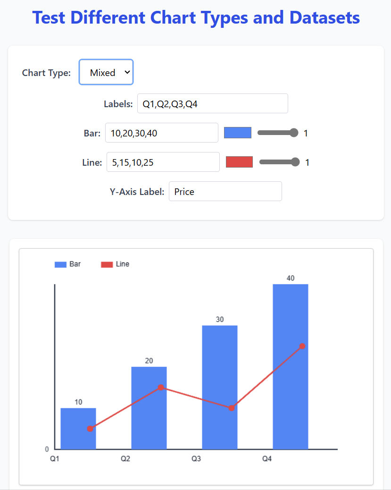

# 📊 MyChart.js

A modern, object-oriented JavaScript charting library inspired by Chart.js. Built from scratch using the HTML5 `<canvas>` API and styled with Tailwind CSS, MyChart.js supports animated and interactive Bar, Line, Pie, Mixed, and Stacked charts. It is designed for both static demos and live DB-driven dashboards.

---

## 📚 Table of Contents

1. [Demo & Examples](#-demo--examples)
2. [Features](#-features)
3. [Installation](#-installation)
4. [Usage](#-usage)
5. [Chart Configuration](#-chart-configuration)
6. [How It Works](#-how-it-works)
7. [Customization & Extensibility](#-customization--extensibility)
8. [PHP/MySQL Backend Configuration](#️-phpmysql-backend-configuration-for-live-data)
9. [Use Cases](#-use-cases)
10. [FAQ / Troubleshooting](#-faq--troubleshooting)
11. [Contributing](#-contributing)
12. [License](#-license)

---

## ✨ Demo & Examples

- **Playground:** Open `index.html` for a full-featured interactive UI (edit data, labels, colors, opacity, and more).
- **Static Gallery:** Open `examples.html` to see all supported chart types as static examples (no controls, just canvases).



---

## 🚀 Features

- ✅ Bar, Line, Pie, Mixed (bar+line), and Stacked charts
- 📊 Multi-series and grouped/stacked bar/line support
- 🖱 Interactive tooltips (including pie charts)
- 🖌 Per-series color pickers and alpha (opacity) sliders
- 🏷 Y-axis label support (customizable)
- 🌀 Smooth animations with toggle
- 🖼 Export as PNG image
- 🧱 Extensible OOP architecture
- 🎨 Modern, responsive UI with Tailwind CSS
- 🗂 Sidebar + topbar admin dashboard layout (see `db_js_chart.html`)
- ⚡ Live DB-driven charts (with PHP/MySQL backend, see below)
- ⚠️ Donut and gap modifiers for pie charts: **TODO** (see code comments)

---

## 📦 Installation

### Option A: Use from GitHub (recommended)
Add the following script tag to your HTML to use the latest version from the official repo:

```html
<script src="https://cdn.jsdelivr.net/gh/imadeous/myChart@latest/myChart.js"></script>
```

Or, for a specific release/tag:

```html
<script src="https://cdn.jsdelivr.net/gh/imadeous/myChart@v1.0.0/myChart.js"></script>
```

### Option B: Clone or Download
Clone the repository or download the files, then include in your HTML:

```html
<script src="myChart.js"></script>
```

---

## 🛠 Usage

### Static Demo (for GitHub Pages or local testing)
- Open `index.html` in your browser. Use the UI to:
  - Select chart type (Bar, Line, Pie, Mixed)
  - Edit data, labels, colors, and opacity live
  - Set a Y-axis label (for bar/line/mixed)
  - Toggle animation
  - Export the chart as PNG
  - See tooltips and legends for all chart types
- All data is static and editable in the UI. No backend required.

### Admin Dashboard (Live DB-Driven)
- Build your own dashboard UI or integrate with your preferred HTML/JS frontend.
- Requires a backend (see `db_chart.php`) and a MySQL `transactions` table with columns: `id`, `user_id`, `amount`, `type`, `description`, `created_at`.
- Charts can include: annual, monthly, daily, pie, quarterly, hourly, and weekly breakdowns.
- All SQL queries are compatible with the schema and handle income/expense type mapping, negative/zero values, and label congestion.
- Data is fetched via AJAX or fetch and rendered with `myChart.js`.

### Static Gallery
- Open `examples.html` to see static examples of all chart types (no controls, just canvases).

---

## ⚙️ Chart Configuration

Each chart is configured with a config object. Example for a multi-series bar chart:

```js
const config = {
  type: 'bar',
  data: {
    labels: ['Q1', 'Q2', 'Q3', 'Q4'],
    datasets: [
      {
        label: 'Product A',
        data: [30, 40, 35, 50],
        backgroundColor: 'rgba(59,130,246,0.7)', // Any CSS color, including alpha
        borderColor: '#3b82f6',
        pointColor: '#3b82f6',
        type: 'bar'
      },
      {
        label: 'Product B',
        data: [20, 25, 30, 35],
        backgroundColor: 'rgba(245,158,66,0.5)',
        borderColor: '#f59e42',
        pointColor: '#f59e42',
        type: 'bar'
      }
    ]
  },
  options: {
    stacked: true, // For stacked bar/line
    yAxisLabel: 'Revenue ($)', // Y-axis label
    // donut, gap (for pie): TODO
  }
};
```

- `backgroundColor`, `borderColor`, and `pointColor` accept any valid CSS color (hex, rgb, rgba, etc).
- `yAxisLabel` (in `options`) sets the vertical Y-axis label.
- For Pie charts, use an array for `backgroundColor` to set per-slice colors.

---

## 🧩 How It Works

- **OOP Design:** Each chart type is a class extending a common `ChartCore` base.
- **Rendering:** Uses the HTML5 Canvas API for all drawing and animation.
- **Responsive:** Canvas resizes with the container; fixed width/height for crisp rendering.
- **UI:** Built with Tailwind CSS for a modern, mobile-first look.
- **Live Editing:** All changes in the UI update the chart instantly.
- **Admin Dashboard:** Responsive sidebar/topbar layout, chart cards, and grid (see `db_js_chart.html`).
- **Live Data:** Fetches and parses data from a PHP/MySQL backend (see `db_chart.php`).
- **Static Mode:** All features work with static data for GitHub Pages or offline use.

---

## 🛠 Customization & Extensibility

- Add new chart types by extending `ChartCore`.
- Customize tooltips, legends, and axis rendering in the respective methods.
- Easily style the UI with Tailwind utility classes.
- Use your own backend or static data as needed.

---

## 💡 Use Cases

MyChart.js is designed to be flexible and powerful for a wide range of data visualization needs. Here are some practical use cases:

- **Business Dashboards:**
  - Visualize sales, revenue, expenses, and profit trends over time.
  - Compare product or service performance by category, region, or channel.
  - Monitor KPIs with real-time or scheduled data updates.

- **Financial Analytics:**
  - Track income and expenses by type, user, or period.
  - Analyze cash flow, account balances, or transaction volumes.
  - Build custom reports for audits or compliance.

- **User & Activity Analytics:**
  - Show user signups, logins, or activity by day/week/month.
  - Leaderboards for top users, contributors, or spenders.
  - Retention, churn, or cohort analysis.

- **Education & Research:**
  - Visualize survey results, experiment data, or academic metrics.
  - Interactive classroom demos for statistics or data science.

- **Custom Reporting:**
  - Build any chart or report that can be expressed as a SQL query and rendered in a browser.
  - Integrate with any backend or data source (not just MySQL/PHP).

- **Static Demos & Prototypes:**
  - Use `index.html` to quickly mock up and share interactive chart ideas with static data.

- **Open Source Projects:**
  - Add beautiful, dependency-free charts to your own web apps, admin panels, or SaaS tools.

If you build something cool with MyChart.js, let us know or contribute your use case to the project!

---

## ❓ FAQ / Troubleshooting

- **Why is my chart blurry?**
  - Make sure the canvas `width` and `height` attributes match its display size for crisp rendering.
- **How do I set opacity?**
  - Use the alpha slider in the UI, or set an `rgba()` color in your config.
- **How do I add a Y-axis label?**
  - Use the Y-axis label input in the UI, or set `options.yAxisLabel` in your config.
- **Pie chart donut/gap?**
  - Not yet implemented (see code comments for TODO).
- **Can I use MyChart.js on GitHub Pages?**
  - Yes! Use `index.html` with static data—no backend required.

---

## 🤝 Contributing

Pull requests and issues are welcome! Please open an issue for bugs or feature requests, or fork and submit a PR.

---

## 📄 License
MIT
